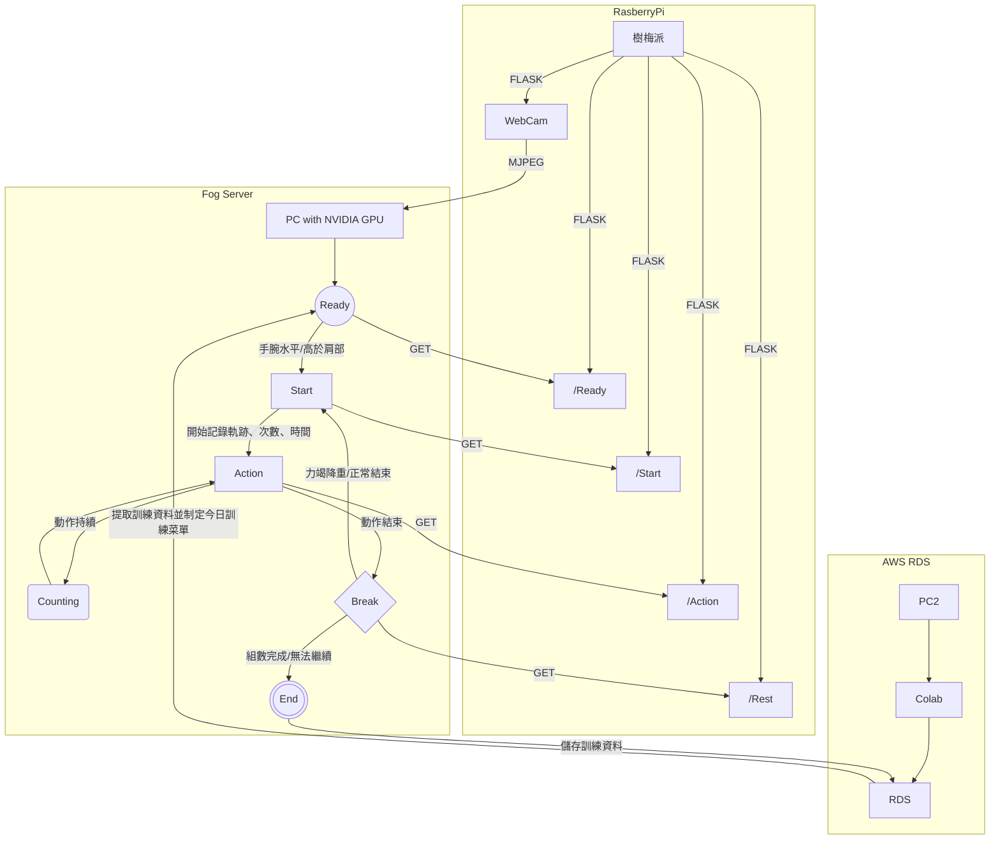

```mermaid

---
config:
  theme: mc
  layout: fixed
---
flowchart TB
    subgraph RasberryPi
        樹梅派 --FLASK--> WebCam & /Ready & /Start & /Action & /Rest
    end
    subgraph Fog Server
    direction TB
    FogServer[PC with NVIDIA GPU]-->Ready
    Ready(("Ready")) -- 手腕水平/高於肩部 --> Start["Start"]
    Start -- 開始記錄軌跡、次數、時間 --> if_state
    if_state[Action] -- 動作持續 --> Counting
    Counting --> if_state
    if_state -- 動作結束 --> Break{"Break"}
    Break -- 力竭降重/正常結束 --> Start
    Break -- 組數完成/無法繼續 --> End["End"]
    Counting@{ shape: rounded}
    End@{ shape: dbl-circ}
    end
    WebCam--MJPEG-->FogServer
    Ready--GET-->/Ready
    Start--GET-->/Start
    if_state--GET-->/Action
    Break--GET-->/Rest
    subgraph AWS RDS
    PC2-->Colab
    Colab-->RDS
    end
    RDS--提取訓練資料並制定今日訓練菜單-->Ready
    End--儲存訓練資料-->RDS
```