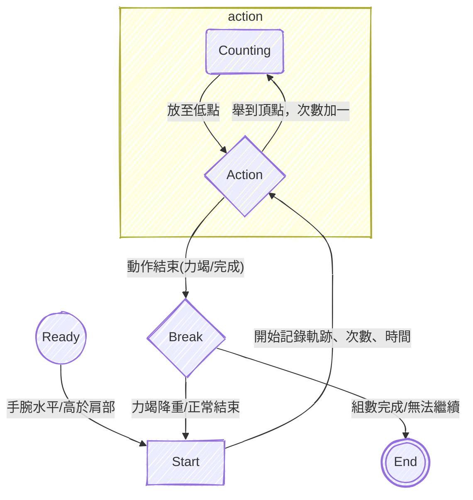

```mermaid

---
config:
  theme: mc
  look: handDrawn
  layout: fixed
---
flowchart TB
 subgraph action["action"]
    direction LR
        Counting["Counting"]
        if_state{"Action"}
  end
    Ready(("Ready")) -- 手腕水平/高於肩部 --> Start["Start"]
    Start -- 開始記錄軌跡、次數、時間 --> if_state
    if_state -- 舉到頂點，次數加一 --> Counting
    Counting -- 放至低點--> if_state
    if_state -- 動作結束(力竭/完成) --> Break{"Break"}
    Break -- 力竭降重/正常結束 --> Start
    Break -- 組數完成/無法繼續 --> End["End"]
    Counting@{ shape: rounded}
    End@{ shape: dbl-circ}
```